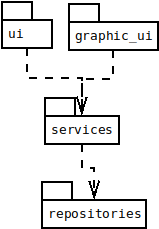
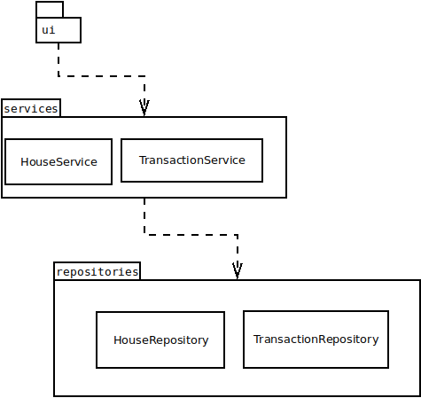
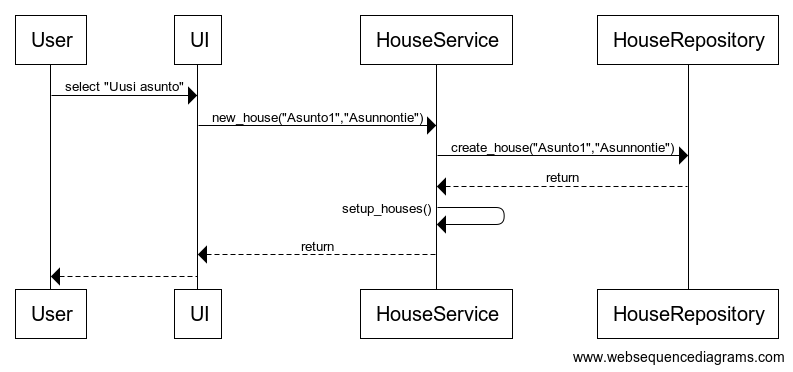
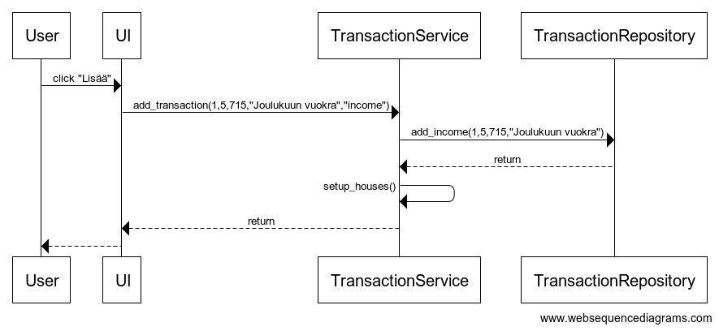

# Arkkitehtuurikuvaus

Koodin pakkausrakenne on seuraavanlainen:

_Ui_ sisälää komentorivi käyttöliittymän, _graphic ui_ sisältää graafisen käyttöliittymän, _services_ sisältää sovelluslogiikkaa ja _repositories_ sisältää tietojen tallenuksesta vastaavaa koodia.

## Käyttöliittymä

Ohjelmassa on kaksi käyttöliittymää: Komentorivi käyttöliittymä ja graafinen käyttöliittymä. Molemmat käyttöliittymät käyttävät samaa tietokantaa.

Komentorivi käyttöliittymä sisältää seuraavat näkymät:
- Raportti
- Asunnot
- Uusi asunto
- Uusi Tulo/Meno
- Muokkaa asunnon tietoja

Graafinen käyttöliittymä sisältää kolme eri näkymää
- Yhteenveto
- Uuden asunnon lisääminen
- Uuden menon tai tulon lisääminen

Graafisessa käyttöliittymässä jokainen sivu on toteutettu omana luokkana. _graphic ui_ huolehtii oikeiden sivujen näyttämisestä.

## Sovelluslogiikka

Ohjelman sovelluslogiikan oleellisimmat luokat ja niiden suhteet

## Tietojen tallennus

_repositories_ luokat `HouseRepository` ja `TransactionsRepository` huolehtivat tietojen tallentamisesta. Ohjelmat tiedot tallennetaan SQLite-tietokantaan. 

Tietokanta sisältää seuraavt taulut:
- Asunnon tiedot `house`
- Tulot ja menot `transactions`
- Tulojen ja menojen kategoriat `category`

Tietokanta alustetaan [initialize_database.py](https://github.com/Shmuli02/ot-harjoitustyo/blob/master/projekti/src/initialize_database.py) tiedostossa. Alustuksessa lisätään valmiita kategorioita.

## Päätoiminnallisuudet

### Uuden asunnon lisääminen

### Uuden tulon lisääminen

## Ohjelman rakenteeseen jääneet heikkoudet

### käyttöliittymä
Graafisessa on jonkin verran toistoa josta pylint valittaa.