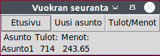
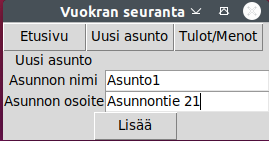
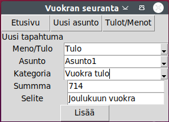
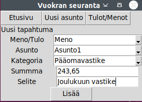

# Käyttöohje

Lataa projektin viimeisin [release](https://github.com/Shmuli02/ot-harjoitustyo/releases)


## Konfigurointi
Tallennukseen käytettävä tiedoston nimi on konfiguroitu .env-tiedostossa. 
```
DATABASE_FILENAME = database.sqlite
```
Ja testaukseen käytettävä tiedoston nimi on konfiguroitu .env.test tiedostossa
```
DATABASE_FILENAME = test-database.sqlite
```


## Ohjelman käynnistäminen

Siirry kansioon `projekti`

Asenna riippuvuudet ennen ohjelman käynnistämistä
```
poetry install
```
Suorita alkutoimenpiteet komennolla
```
poetry run invoke build
```
Graafisen ohjelman voi käynnistää komennolla 
```
poetry run invoke start
```
Komentorivi ohjelman voi käynnistää komennolla
```
poetry run python3 src/index.py commandline
```
tai komennolla 
```
poetry run invoke commandline
```
(Kun ohjelman käynnistää invokella syötteissä backspace ei toimi)

## Graafinen käyttöliittymä

### Aloitusnäkymä

Sovellus käynnistyy yhteenveto näkymään



Yhteenveto näkymässä näkyy kaikki asunnot sekä niiden tulot ja menot yhteensä.

### Uuden asunnon lisääminen
Ohjelmassa on mahdollista siirtyä uuden asunnon luomisnäkymään painamalla ylävalikossa olevaa painiketta "Uusi asunto"



Uusi asunto saadaan luotua syöttämällä vaaditut tiedot ja painamalla "Lisää"-painiketta.

### Uuden tulon tai menon lisääminen
Ohjelmassa on mahdollista siirtyä uuden tulon/menon luomisnäkymään painamalla ylävalikossa olevaa painiketta "Tulot/Menot"





Uuden tulon/menon saa lisättyä syöttämällä vaaditut tiedot ja painamalla "Lisää"-painiketta.


