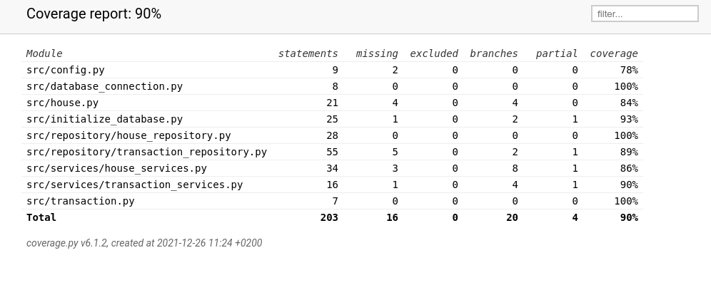

# Testausdokumentti

Sovellusta on testattu automaattisilla unittesteilla sekä manuaallisesti tapahtuvilla järjestelmätason testillä.

## yksikkö- ja integraatiotestaus

### Sovelluslogiikka

Sovelluslogiikasta vastaava `HouseService`-luokkaa testataan [TestHouse](../src/tests/house_test.py)-testiluokassa ja `TransactionService`-luokkaa testataan [TestTransactions](../src/tests/transaction_test.py)-testiluokassa.

### Repositorio-luokat

Repositorio-luokkia `HouseRepository` ja `TransactionRepository` testataan [TestHouse](../src/tests/house_test.py) ja [TestTransactions](../src/tests/transaction_test.py)-testiluokissa

### Testauskattavuus

Käyttöliittymä kerroksia lukuunottamatta soveluksen testauksen haaraumakattavuus on 90%

## Järjestelmätestaus

Sovelluksen järjestelmätestaus on suoritettu manuaalisesti.

### Asennus ja konfigurointi

Sovellus on asennettu ja testattu [käytöohjeiden](../dokumentaatio/kayttoohje.md) kuvaamalla tavalla eri linux ympäristöissä

## Sovellukseen jääneet laatuongelmat

Kun komentoriviohjelman käynnistää invoke ohjelmalla niin input syötteisä backspace näppäin ei toimi. Ohjelma tulisi käynnistää komennolla `poetry run python3 src/index.py commandline`

